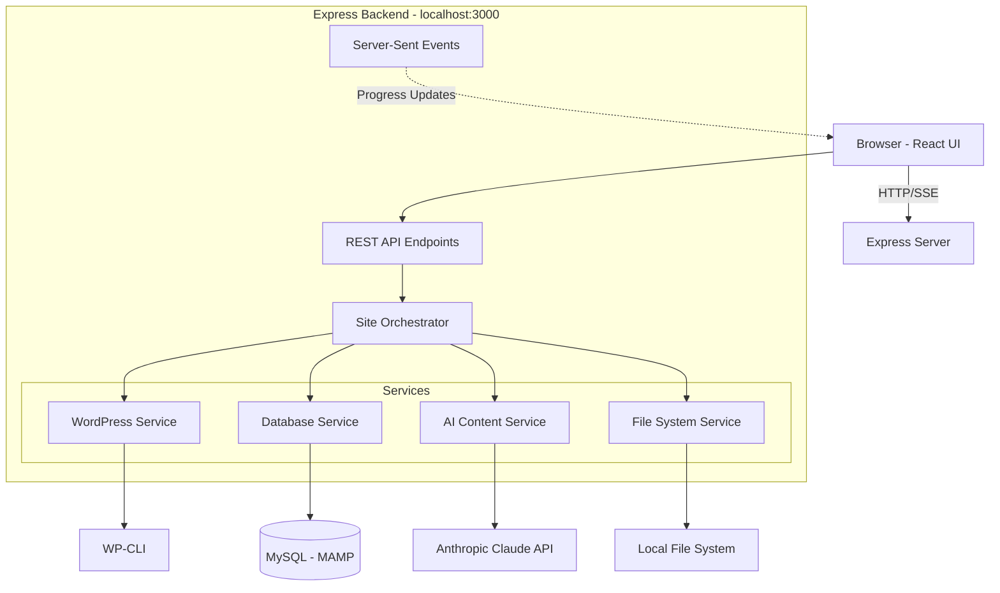
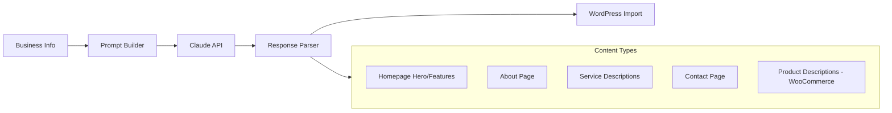
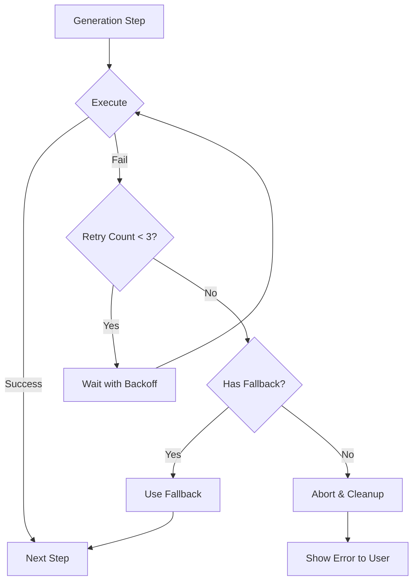

# WordPress Site Generator - Architecture Plan

## Project Summary

Build a **local web application** (Express backend + React frontend) for **personal macOS use** that automates WordPress site creation. Run `npm start` to launch the UI in your browser, input business information, select a theme, and click "Generate" to receive a fully configured WordPress site ready for deployment.

---

## 1. System Architecture

### Simplified: Express + React Local Web App



### Why Local Web App (Personal Use)

| Aspect | Benefit |

|--------|---------|

| **Simpler Development** | Standard web stack, faster iteration |

| **No Distribution Complexity** | Run locally with `npm start`, no packaging needed |

| **Easier Debugging** | Standard browser DevTools + Node.js debugging |

| **Reuse Existing Skills** | Leverage Tailwind/Framer Motion from Wordpress_Agency |

| **Lightweight** | No Electron overhead, direct Node.js access to system |

| **One-Time Setup** | Hardcode MAMP config in `.env` file, never ask again |

---

## 2. Technology Stack

### Frontend

- **React 19** + **TypeScript** - UI components
- **Tailwind CSS** - Styling (reuse neo-brutalist design from existing project)
- **Framer Motion** - Animations for progress states
- **React Hook Form** - Form handling with validation
- **Vite** - Build tool for frontend development

### Backend

- **Express.js** - HTTP server and REST API
- **Node.js 22.x LTS** - Core runtime (Maintenance LTS)
- **Server-Sent Events (SSE)** - Real-time progress updates to browser
- **WP-CLI** - WordPress automation (download, install, configure)
- **mysql2** - Database connection to local MAMP MySQL
- **better-sqlite3** - Job persistence and state management
- **Anthropic SDK** (`@anthropic-ai/sdk`) - Claude API integration
- **execa** - Shell command execution (with strict no-shell mode)
- **fs-extra** - Enhanced file system operations
- **dotenv** - Environment variable management for one-time config
- **pino** + **pino-pretty** - High-performance structured logging with secret redaction
- **tsx** - Fast TypeScript execution (dev + production for simplicity)

### Project Configuration

**`.env` file** (created once, never needs UI):

```env
# MAMP Configuration (set once)
MYSQL_HOST=localhost
MYSQL_PORT=8889
MYSQL_USER=root
MYSQL_PASSWORD=root
MYSQL_SOCKET=/Applications/MAMP/tmp/mysql/mysql.sock

# WP-CLI Configuration
WPCLI_PATH=/usr/local/bin/wp
WP_CLI_PHP=/Applications/MAMP/bin/php/php8.2.0/bin/php

# Web Server Configuration
WEB_ROOT=/Applications/MAMP/htdocs
BASE_URL=http://localhost:8888

# Default Output Directory
SITES_DIR=/Users/YOUR_USERNAME/Sites

# Anthropic API Key
ANTHROPIC_API_KEY=sk-ant-xxxxx

# AI Cost Limits
AI_COST_HARD_LIMIT_USD=1.00

# Logging
LOG_LEVEL=info
```

### Development Dependencies

```json
{
  "name": "wordpress-site-generator",
  "engines": {
    "node": ">=22.0.0"
  },
  "scripts": {
    "dev": "concurrently \"npm run server\" \"npm run client\"",
    "server": "tsx watch server/index.ts",
    "client": "vite",
    "build": "vite build",
    "start": "npm run dev"
  },
  "dependencies": {
    "@anthropic-ai/sdk": "^0.30.x",
    "express": "^4.x",
    "mysql2": "^3.x",
    "better-sqlite3": "^11.x",
    "execa": "^9.x",
    "fs-extra": "^11.x",
    "dotenv": "^16.x",
    "cors": "^2.x",
    "pino": "^9.x",
    "pino-pretty": "^11.x",
    "react": "^19.x",
    "react-dom": "^19.x",
    "react-hook-form": "^7.x"
  },
  "devDependencies": {
    "@vitejs/plugin-react": "^4.x",
    "vite": "^6.x",
    "typescript": "^5.x",
    "tsx": "^4.x",
    "concurrently": "^9.x",
    "tailwindcss": "^4.x"
  }
}
```

---

## 3. WordPress Automation Approach

### WP-CLI as Primary Tool

[WP-CLI](https://wp-cli.org/) is the standard command-line interface for WordPress. It handles:

- Downloading WordPress core
- Database configuration (`wp-config.php`)
- Core installation
- Plugin/theme installation and activation
- User creation
- Option updates
- Content creation (pages, posts, menus)

### Prerequisites (One-Time Setup)

Before first use, ensure:

```bash
# 1. Install WP-CLI (if not installed)
brew install wp-cli

# 2. Verify MAMP is running
# Open MAMP app, start servers

# 3. Test MySQL connection
mysql -h localhost -P 8889 -u root -p  # password: root

# 4. Create .env file with your paths
```

### WP-CLI Execution Context

WordPress sites will be created directly in MAMP's `htdocs` directory (e.g., `/Applications/MAMP/htdocs/business-name-1`), making them immediately accessible at `http://localhost:8888/business-name-1`.

**Automated PHP Version Configuration:**
The preflight checks will auto-detect the best PHP version in MAMP (preferring 8.2+) and automatically configure WP-CLI to use it. No user configuration needed—just input business info and click generate.

**Directory Strategy:**
```bash
# Create site in MAMP htdocs
cd /Applications/MAMP/htdocs
wp core download --path=./business-name-1

# All WP-CLI commands run with --path flag or from within the site directory
cd /Applications/MAMP/htdocs/business-name-1
wp config create --dbname=business_db_1 ...
```

**Unique Site Identifiers:**
To prevent conflicts with repeated business names, append incremental numbers:
- `joes-plumbing-1`, `joes-plumbing-2`, etc.
- Database names: `joes_plumbing_1`, `joes_plumbing_2`
- Check for existing directories/databases and increment automatically

**Deployment:**
Sites are generated locally in MAMP htdocs. Deployment automation will be handled separately (outside this tool's scope).

### Core WordPress Operations

**Step 1: Determine unique site identifier**

```javascript
// Find next available number for this business
const baseName = slugify(businessName); // 'joes-plumbing'
let counter = 1;
while (await fs.pathExists(`${WEB_ROOT}/${baseName}-${counter}`)) {
  counter++;
}
const siteName = `${baseName}-${counter}`;
const dbName = sanitizeDbName(`${baseName}_${counter}`);
```

**Step 2: Create project directory in MAMP htdocs**

```bash
mkdir -p /Applications/MAMP/htdocs/joes-plumbing-1
cd /Applications/MAMP/htdocs/joes-plumbing-1
```

**Step 2: Download WordPress**

```bash
wp core download --locale=en_US --path=/Applications/MAMP/htdocs/joes-plumbing-1
```

**Step 3: Configure database**

```bash
wp config create \
  --dbname=joes_plumbing_1 \
  --dbuser=root \
  --dbpass=root \
  --dbhost=localhost:8889 \
  --path=/Applications/MAMP/htdocs/joes-plumbing-1
```

**Step 4: Create database**

```bash
wp db create --path=/Applications/MAMP/htdocs/joes-plumbing-1
```

**Step 5: Install WordPress**

```bash
wp core install \
  --url=http://localhost:8888/joes-plumbing-1 \
  --title="Joe's Plumbing" \
  --admin_user=admin \
  --admin_password=generated_secure_password \
  --admin_email=owner@business.com \
  --path=/Applications/MAMP/htdocs/joes-plumbing-1
```

**Step 6: Install/activate theme**

```bash
wp theme install astra --activate --path=/Applications/MAMP/htdocs/joes-plumbing-1
```

**Step 7: Install plugins**

```bash
wp plugin install contact-form-7 wordpress-seo --activate --path=/Applications/MAMP/htdocs/joes-plumbing-1
```

**Step 8: Create pages with AI content (done last, after WordPress is fully configured)**

```bash
# SECURITY: Write content to temporary file, then import
wp post create /tmp/content-${timestamp}.html \
  --post_type=page \
  --post_title="About Us" \
  --post_status=publish \
  --path=/Applications/MAMP/htdocs/joes-plumbing-1

# Delete temp file immediately after import
rm /tmp/content-${timestamp}.html
```

---

## 4. AI Content Generation Strategy

### Anthropic Claude Integration

**Model Choice**: Multi-tier approach based on content complexity

**Primary Model**: Claude Sonnet 4.5 (`claude-sonnet-4-5-20251101`)

- Best balance of quality and cost for content generation
- Strong at following brand voice and niche-specific content
- $3 per million input tokens, $15 per million output tokens

**Economy Model**: Claude Haiku 4.5 (`claude-haiku-4-5-20251101`)

- For simple, boilerplate content (contact pages, terms, privacy)
- $1 per million input tokens, $5 per million output tokens

**Model Selection Strategy**:

```javascript
const MODEL_TIERS = {
  creative: 'claude-sonnet-4-5-20251101',  // Homepage, About, Services
  standard: 'claude-sonnet-4-5-20251101',  // Blog posts, product descriptions
  simple: 'claude-haiku-4-5-20251101'      // Contact, legal pages, boilerplate
};
```

### Content Generation Pipeline



### Prompt Structure per Content Type

All prompts use **instruction libraries** - predefined rule packs that ensure consistency and prevent AI hallucination.

**Homepage Hero:**

```
${CONTENT_INSTRUCTIONS.homepage}

You are a professional copywriter. Create homepage content for:
- Business: <business_name>{businessName}</business_name>
- Industry: <niche>{niche}</niche>
- Services: <services>{services}</services>

Generate:
1. Hero headline (max 10 words)
2. Hero subheadline (max 25 words)
3. 3 feature blocks with titles and descriptions
4. Call-to-action text

Output as JSON.
```

**About Page:**

```
${CONTENT_INSTRUCTIONS.about}

Write an "About Us" page for <business_name>{businessName}</business_name>, 
a {niche} company located in <address>{address}</address>.

Include:
- Company story/mission (150-200 words)
- Values section (3 core values with descriptions)
- Team introduction placeholder

Tone: Professional yet approachable.
Output as HTML.
```

**AI Instruction Library** (see Section 20 for full details):

- Prevents fabrication of credentials, certifications, or specific claims
- Enforces tone and style consistency
- Sets boundaries for content length and structure

### Estimated AI Costs per Site (with Model Tiering)

| Content Type | Model | Est. Input/Output Tokens | Cost |

|-------------|-------|-------------------------|------|

| Homepage | Sonnet 4.5 | 500/1,500 | $0.024 |

| About Page | Sonnet 4.5 | 400/1,200 | $0.019 |

| Services (5) | Sonnet 4.5 | 600/2,500 | $0.039 |

| Contact Page | Haiku 4.5 | 200/400 | $0.002 |

| Products (10, if e-commerce) | Sonnet 4.5 | 800/4,000 | $0.062 |

| **Total Standard Site** | Mixed | ~7,200 | **~$0.08** |

| **Total E-commerce** | Mixed | ~12,000 | **~$0.15** |

**Note**: Actual costs are tracked per-run using real token usage from API responses, not estimates. Hard limit prevents runaway costs.

### Fallback Strategy

If Claude API fails or cost limit is reached:

1. **Retry with exponential backoff** (3 attempts) for API failures
2. **Use niche-specific placeholder templates** with business name injection
3. **Log gracefully** with structured logging (pino) and continue with placeholders
4. **Complete site generation** - user can manually edit content later

**Placeholder Template Example:**
```html
<!-- Generic + Industry-specific template for plumbing -->
<h1>Welcome to ${businessName}</h1>
<p>Your trusted plumbing experts serving ${city}. We provide professional plumbing services including repairs, installations, and emergency services.</p>

<!-- Niche-specific features -->
<ul>
  <li>24/7 Emergency Service</li>
  <li>Licensed & Insured</li>
  <li>Residential & Commercial</li>
</ul>
```

### Cost Control & Monitoring

**Real-time Usage Tracking:**

- Track actual input/output tokens from API responses (not estimates)
- Calculate running cost per job
- Display cost breakdown in UI completion screen

**Hard Limit Protection:**

```javascript
const HARD_LIMIT_USD = parseFloat(process.env.AI_COST_HARD_LIMIT_USD || '1.00');

if (jobCostTracker.totalCost >= HARD_LIMIT_USD) {
  // Complete non-AI tasks (WordPress install, plugins, themes)
  // Skip remaining AI content generation
  // Use placeholder templates for remaining pages
  logger.warn(`AI cost limit reached: $${jobCostTracker.totalCost.toFixed(2)}. Using placeholders for remaining content.`);
  return usePlaceholderContent();
}
```

**Prompt Caching:**

- Cache system prompts and instruction libraries (90% cost savings on repeated context)
- TTL: 5 minutes (Anthropic standard)
- Reduces latency by up to 85% for cached content
```javascript
// Enable prompt caching with beta header
const response = await anthropic.messages.create({
  model: 'claude-sonnet-4-5-20251101',
  system: [{
    type: 'text',
    text: SYSTEM_PROMPT,
    cache_control: { type: 'ephemeral' }
  }],
  messages: [...],
}, {
  headers: { 'anthropic-beta': 'prompt-caching-2024-07-31' }
});
```


---

## 5. User Interface Design

### Main Screens

**1. Home/Dashboard** (http://localhost:3000)

```
┌─────────────────────────────────────────────────────────────┐
│  WordPress Site Generator                          [Status]  │
├─────────────────────────────────────────────────────────────┤
│                                                              │
│  Recent Sites:                                               │
│  - Joe's Plumbing (2 days ago) - http://localhost:8888/...  │
│    [🌐 Open] [📁 Folder] [🗑️ Delete]                        │
│  - ABC Salon (1 week ago)                                    │
│    [🌐 Open] [📁 Folder] [🗑️ Delete]                        │
│                                                              │
│               [ + Create New Site ]                          │
│                                                              │
│  System Status:                                              │
│  ✓ WP-CLI detected                                           │
│  ✓ MySQL connection (MAMP)                                   │
│  ✓ Anthropic API configured                                  │
└─────────────────────────────────────────────────────────────┘
```

**Note:** Each site has inline delete button for quick cleanup

**2. New Site Form** (/create)

```
┌─────────────────────────────────────────────────────────────┐
│  Create New WordPress Site                                   │
├─────────────────────────────────────────────────────────────┤
│  Business Information                                        │
│  ┌─────────────────────────────────────────────────────┐    │
│  │ Business Name: [________________________]  *Required │    │
│  │ Industry/Niche: [Dropdown ▼ Select...] *Required    │    │
│  │ Address: [________________________]                  │    │
│  │ Phone: [________________________]                    │    │
│  │ Email: [________________________]                    │    │
│  │                                                      │    │
│  │ Additional Context (optional):                       │    │
│  │ [                                                    ]    │
│  │ [   Any additional information to help              ]    │
│  │ [   generate better content                         ]    │
│  │ [                                                    ]    │
│  └─────────────────────────────────────────────────────┘    │
│                                                              │
│  Site Type: ( ) Standard Website  ( ) E-commerce Shop       │
│                                                              │
│               [ Generate Site ]  [ 🧪 Dry Run ]             │
└─────────────────────────────────────────────────────────────┘
```

**Note:** Form uses dropdown for niche selection (10 options: Plumbing, Salon, Dental, Legal, Restaurant, Fitness, Real Estate, Accounting, Automotive, General/Other)

**3. Progress Screen** (/generate/:id)

```
┌─────────────────────────────────────────────────────────────┐
│  Generating: Joe's Plumbing                                  │
├─────────────────────────────────────────────────────────────┤
│                                                              │
│  [████████████░░░░░░░░░░░░] 45%                              │
│                                                              │
│  ✓ Created project directory                                 │
│  ✓ Downloaded WordPress 6.4.2                                │
│  ✓ Configured database                                       │
│  ✓ Installed WordPress core                                  │
│  → Generating AI content...                                  │
│  ○ Installing theme                                          │
│  ○ Installing plugins                                        │
│  ○ Creating pages                                            │
│  ○ Configuring SEO                                           │
│                                                              │
│  Real-time log:                                              │
│  [14:32:15] Running: wp core download                        │
│  [14:32:23] Success: WordPress downloaded                    │
│  [14:32:24] Generating AI content for homepage...            │
│  [14:32:28] AI cost so far: $0.03 / $1.00 limit              │
│                                                              │
│               [ Cancel ]                                     │
└─────────────────────────────────────────────────────────────┘
```

**4. Completion Screen**

```
┌─────────────────────────────────────────────────────────────┐
│  ✓ Site Generated Successfully!                              │
├─────────────────────────────────────────────────────────────┤
│                                                              │
│  Joe's Plumbing is ready!                                    │
│                                                              │
│  📁 Location: ~/Sites/joes-plumbing                          │
│  🌐 URL: http://localhost:8888/joes-plumbing                 │
│                                                              │
│  Admin Credentials:                                          │
│  Username: admin                                             │
│  Password: jP#k9$mN2xQ7  [Copy]                              │
│                                                              │
│  Quick Actions:                                              │
│  [ Open in Browser ] [ Open Folder ] [ Copy Credentials ]   │
│                                                              │
│  Next Steps:                                                 │
│  1. Review and customize the generated content               │
│  2. Add your logo and brand assets                           │
│  3. Export to hosting provider (File > Export)               │
│                                                              │
│               [ Create Another Site ]                        │
└─────────────────────────────────────────────────────────────┘
```

---

## 6. Theme and Plugin Recommendations

### Curated Theme List (5 Recommended)

Selection criteria:

- Free and actively maintained
- Good PageSpeed scores (90+)
- Compatible with WordPress block editor
- Highly customizable
- Works well with popular page builders

**Recommended Themes:**

1. **Astra** - Lightweight, fast, extremely customizable
2. **OceanWP** - Feature-rich, e-commerce ready
3. **Neve** - Modern, clean, excellent performance
4. **GeneratePress** - Minimalist, developer-friendly
5. **Blocksy** - Block editor optimized, modern design

### Plugin Sets by Site Type

**Standard Website (Core Set):**

- **Contact Form 7** - Forms and contact management
- **Yoast SEO** - SEO optimization
- **UpdraftPlus** - Automated backups
- **WP Super Cache** - Performance optimization
- **Wordfence Security** - Security hardening

**E-commerce (adds to core set):**

- **WooCommerce** - Store functionality
- **Stripe for WooCommerce** - Payment gateway
- **WooCommerce PDF Invoices & Packing Slips** - Order management

**By Niche:**

| Niche | Additional Plugins |

|-------|-------------------|

| Restaurant | Restaurant Reservations, Food Menu |

| Salon/Spa | Simply Schedule Appointments |

| Real Estate | Easy Property Listings |

| Portfolio | Envira Gallery |

| Professional Services | Calendly integration, Testimonials widget |

---

## 7. Database Setup Strategy

### Connection to MAMP MySQL (macOS)

Since this is personal use on Mac with MAMP, hardcode the configuration:

```javascript
// server/services/database.ts
import mysql from 'mysql2/promise';
import dotenv from 'dotenv';

dotenv.config();

export const createConnection = async () => {
  return await mysql.createConnection({
    host: process.env.MYSQL_HOST || 'localhost',
    port: parseInt(process.env.MYSQL_PORT || '8889'),
    user: process.env.MYSQL_USER || 'root',
    password: process.env.MYSQL_PASSWORD || 'root',
    socketPath: process.env.MYSQL_SOCKET || '/Applications/MAMP/tmp/mysql/mysql.sock'
  });
};
```

### Database Operations

1. **Create database** for each site (sanitized business name)
   ```javascript
   const dbName = sanitizeDbName(businessName);
   await connection.query(`CREATE DATABASE IF NOT EXISTS \`${dbName}\` CHARACTER SET utf8mb4 COLLATE utf8mb4_unicode_ci`);
   ```

2. **Configure wp-config.php** with credentials via WP-CLI
3. **Cleanup on failure** - delete database if generation fails

---

## 8. Directory Structure

```
wordpress-site-generator/
├── package.json
├── .env                         # Configuration (not committed)
├── .env.example                 # Template for setup
├── tsconfig.json
├── vite.config.ts               # Frontend build config
├── data/
│   └── jobs.db                  # SQLite job persistence
├── server/                      # Express backend
│   ├── index.ts                 # Express server entry point
│   ├── routes/
│   │   ├── sites.ts             # REST API endpoints
│   │   └── progress.ts          # SSE endpoint for progress
│   ├── services/
│   │   ├── wordpress.service.ts # WP-CLI wrapper (file-based content)
│   │   ├── database.service.ts  # MySQL operations
│   │   ├── ai-content.service.ts # Claude integration with cost tracking
│   │   ├── file-system.service.ts # Directory operations
│   │   ├── preflight.service.ts # Startup health checks
│   │   ├── job-manager.service.ts # Job persistence & recovery
│   │   └── site-generator.service.ts # Orchestrator
│   ├── config/
│   │   ├── themes.ts            # Theme definitions
│   │   ├── plugins.ts           # Plugin sets by niche
│   │   ├── prompts.ts           # AI prompt templates
│   │   └── ai-instructions/     # Rule packs for each content type
│   │       ├── index.ts         # Exports all instruction sets
│   │       ├── homepage.ts      # Homepage content rules
│   │       ├── about.ts         # About page rules
│   │       ├── services.ts      # Services page rules
│   │       └── products.ts      # Product description rules
│   ├── db/
│   │   └── jobs.ts              # SQLite schema & queries
│   └── utils/
│       ├── wpcli.ts             # WP-CLI command builder
│       ├── sanitize.ts          # Input sanitization
│       └── logger.ts            # Pino structured logging setup
├── client/                      # React frontend
│   ├── index.html
│   ├── src/
│   │   ├── main.tsx
│   │   ├── App.tsx
│   │   ├── components/
│   │   │   ├── Dashboard.tsx
│   │   │   ├── SiteForm.tsx
│   │   │   ├── ThemeSelector.tsx
│   │   │   ├── ProgressView.tsx
│   │   │   └── CompletionView.tsx
│   │   ├── hooks/
│   │   │   ├── useGeneration.ts
│   │   │   └── useSSE.ts        # Server-Sent Events hook
│   │   └── api/
│   │       └── client.ts        # API client
│   └── public/
│       └── theme-previews/      # Theme screenshot images
├── shared/
│   └── types.ts                 # Shared TypeScript types
└── generated-sites/             # Output directory (git-ignored)
```

---

## 9. Implementation Phases

### Phase 1: MVP Foundation (Core Functionality)

**Goals:**

- Get basic site generation working end-to-end
- No AI content yet (use placeholder text)
- Single theme support
- Core plugin set only
- Solid foundation with preflight checks and job persistence

**Tasks:**

1. Set up Express + React project structure with Vite 6.x
2. Configure tsx for fast TypeScript development (dev + production)
3. Set up pino structured logging with secret redaction
4. Create `.env` configuration system
5. **Implement preflight checks service** (WP-CLI, PHP auto-detection, MySQL, paths)
6. Set up SQLite job persistence database with resumption support
7. Build basic site form (business name, niche, address, phone, email, additional context)
8. **Create niche-specific placeholder templates** (generic + industry-specific)
9. **Implement WP-CLI service wrapper with file-based content** (security fix)
10. Implement database service (create DB with numeric suffixes for uniqueness)
11. Build WordPress installation orchestrator with job state tracking
12. Create progress view with Server-Sent Events (simple reconnection)
13. **Implement dry-run mode** for testing without creating real sites
14. **Implement cleanup utility** for removing test sites
15. Test complete workflow with placeholder content

**Deliverable**: Generate a working WordPress site with niche-specific placeholder content in MAMP htdocs, preflight checks with PHP auto-detection, persistent job state with resumption, dry-run mode, and cleanup tools

### Phase 2: AI Content Integration

**Goals:**

- Replace placeholder content with AI-generated copy
- Support multiple content types (homepage, about, services, contact)
- Handle API errors gracefully
- Implement cost tracking and optimization
- **AI content generation runs last** (after WordPress install, plugins, themes)

**Tasks:**

1. Integrate Anthropic Claude SDK with updated model IDs (Sonnet 4.5, Haiku 4.5)
2. **Create AI instruction library** (rule packs for each content type)
3. Create prompt templates for each content type with instruction integration
4. **Implement model tiering** (Haiku for simple content, Sonnet for creative)
5. Build content generation service with **real-time usage tracking**
6. **Add prompt caching** for system prompts and instructions
7. **Implement hard cost limit** protection (graceful fallback to placeholders)
8. Implement retry logic and fallback templates
9. Update orchestrator to run AI generation **after** WordPress core setup
10. Display actual cost breakdown in completion screen

**Deliverable**: AI-powered content generation with cost optimization, tracking, and graceful degradation when limits are reached

### Phase 3: E-commerce & Polish

**Goals:**

- WooCommerce support
- Product generation
- Niche-specific plugin sets
- UI polish

**Tasks:**

1. Add WooCommerce installation logic
2. Generate sample products with AI descriptions
3. Implement niche-specific plugin configurations
4. Add theme selection UI with previews (Astra, OceanWP, Neve, GeneratePress, Blocksy)
5. Improve progress animations
6. Add export/deployment instructions

**Deliverable**: Full e-commerce site generation support with theme selection

---

## 10. Additional Input Recommendations

To improve generated site quality, consider adding these optional fields:

| Field | Purpose | Priority |

|-------|---------|----------|

| **Tagline/Slogan** | Used in meta description and hero | High |

| **Primary Services** (multiselect) | Generates individual service pages | High |

| **Business Hours** | Contact page, schema markup | Medium |

| **Social Media URLs** | Footer links, social schema | Medium |

| **Logo Upload** | Site identity and branding | Low |

| **Brand Colors** (2-3) | Theme customization | Low |

| **Target Audience** | Influences AI content tone | Medium |

| **Unique Selling Points** (3-5) | Featured in homepage | High |

---

## 11. Security Best Practices

- **API Key Storage**: Store in `.env` file, never commit to git
- **Generated Passwords**: Use `crypto.randomBytes()` for strong admin passwords
- **Input Sanitization**: Sanitize all user inputs for database/directory names
  ```javascript
  const sanitizeDbName = (name: string) => {
    return name.toLowerCase()
      .replace(/[^a-z0-9]/g, '_')
      .substring(0, 64);
  };
  ```

- **File Permissions**: Set secure permissions on wp-config.php (600)
- **No Sensitive Data in Logs**: Redact passwords in progress updates
- **CORS**: Restrict to localhost only in Express config

---

## 12. Error Handling Strategy



**Cleanup on failure:**

- Delete created database
- Remove partial WordPress files
- Log detailed error with timestamp
- Send error event via SSE to update UI

---

## 13. Real-Time Progress Updates (SSE)

### Server-Side Implementation

```typescript
// server/routes/progress.ts
import { Request, Response } from 'express';

export const progressSSE = (req: Request, res: Response) => {
  const { siteId } = req.params;
  
  res.setHeader('Content-Type', 'text/event-stream');
  res.setHeader('Cache-Control', 'no-cache');
  res.setHeader('Connection', 'keep-alive');
  
  // Subscribe to progress events for this site
  const subscription = progressEmitter.subscribe(siteId, (progress) => {
    res.write(`data: ${JSON.stringify(progress)}\n\n`);
  });
  
  req.on('close', () => subscription.unsubscribe());
};
```

### Client-Side Hook

```typescript
// client/src/hooks/useSSE.ts
export const useSSE = (siteId: string) => {
  const [progress, setProgress] = useState<ProgressEvent[]>([]);
  
  useEffect(() => {
    const eventSource = new EventSource(`/api/progress/${siteId}`);
    
    eventSource.onmessage = (event) => {
      const data = JSON.parse(event.data);
      setProgress(prev => [...prev, data]);
    };
    
    eventSource.onerror = () => {
      // Simple error handling - show message to user
      console.error('Progress connection lost');
      eventSource.close();
    };
    
    return () => eventSource.close();
  }, [siteId]);
  
  return progress;
};
```

**Note:** Phase 1 uses basic SSE without auto-reconnection. User can manually refresh to check status if connection is lost. Improvements will be added in later phases.

---

## 14. Open Considerations

**Questions for future refinement:**

1. **Multi-language support** - Should generated sites support i18n plugins?
2. **Template persistence** - Save successful generations as reusable templates?
3. **Backup before deploy** - Auto-create backup before client uploads to hosting?
4. **Version control** - Initialize git repo for each generated site?
5. **Staging preview** - Spin up temporary preview URL before finalizing?

---

## 15. Development & Testing Tools

### Dry-Run Mode

Simulate site generation without creating actual files or databases (similar to AWS CDK synth):

```typescript
// server/services/site-generator.service.ts
interface GenerationOptions {
  dryRun?: boolean;  // Default: false
}

async function generateSite(config: SiteConfig, options: GenerationOptions = {}) {
  if (options.dryRun) {
    logger.info('DRY RUN MODE - No files or databases will be created');
    
    // Simulate all steps with logging
    await simulateStep('Check for existing sites', 500);
    await simulateStep('Download WordPress core', 2000);
    await simulateStep('Configure database', 800);
    await simulateStep('Install plugins and theme', 1500);
    await simulateStep('Generate AI content', 3000);
    
    return {
      success: true,
      message: 'Dry run completed successfully',
      estimatedTime: '~25 seconds',
      estimatedCost: '$0.08'
    };
  }
  
  // Real generation logic
  // ...
}
```

**Usage in UI:**
- Add `[ 🧪 Dry Run ]` button next to `[ Generate Site ]`
- Display simulated progress with estimated timings
- Show "This was a simulation" banner in completion screen

### Cleanup Script

Quickly remove test sites from MAMP and database:

```typescript
// server/utils/cleanup.ts
interface CleanupOptions {
  siteId: string;  // Job ID to remove
}

async function cleanupSite(options: CleanupOptions) {
  const job = getJob(options.siteId);
  
  if (!job) {
    throw new Error(`Job not found: ${options.siteId}`);
  }
  
  logger.info({ jobId: job.id, siteName: job.businessName }, 'Cleaning up site');
  
  // 1. Drop database
  if (job.dbName) {
    await connection.query(`DROP DATABASE IF EXISTS \`${job.dbName}\``);
    logger.info(`Deleted database: ${job.dbName}`);
  }
  
  // 2. Remove site directory
  if (job.sitePath) {
    await fs.remove(job.sitePath);
    logger.info(`Deleted directory: ${job.sitePath}`);
  }
  
  // 3. Mark job as deleted in SQLite
  updateJobStatus(job.id, 'deleted');
  
  return {
    success: true,
    site: job.businessName
  };
}
```

**Expose as API endpoint:**

```typescript
// server/routes/sites.ts
router.delete('/api/sites/:id', async (req, res) => {
  const { id } = req.params;
  
  try {
    const result = await cleanupSite({ siteId: id });
    res.json(result);
  } catch (err) {
    res.status(404).json({ error: err.message });
  }
});
```

**UI Integration:**
Dashboard shows recent sites list with [🗑️ Delete] button next to each site. Clicking delete:
1. Shows confirmation modal ("Delete [Business Name]? This will remove the WordPress files and database.")
2. Calls DELETE API endpoint
3. Removes site from list
4. Shows success notification

---

## 16. Estimated Effort

| Phase | Time Estimate | Complexity |

|-------|--------------|------------|

| Phase 1: MVP Foundation | 2-3 days | Medium - Core infrastructure, WP-CLI integration |

| Phase 2: AI Integration | 1-2 days | Low-Medium - API integration, prompt engineering |

| Phase 3: E-commerce & Polish | 1-2 days | Low-Medium - WooCommerce config, UI refinements |

| **Total** | **4-7 days** | - |

---

## 17. Getting Started Checklist

Before starting development:

- [ ] Install MAMP and start MySQL/Apache servers
- [ ] Install Node.js 22.x LTS: `nvm install 22` or download from nodejs.org
- [ ] Install WP-CLI: `brew install wp-cli`
- [ ] Verify WP-CLI: `wp --info` (PHP version will be auto-configured on first run)
- [ ] Get Anthropic API key from console.anthropic.com
- [ ] Create `data/` directory for SQLite job persistence
- [ ] Test MySQL connection: `mysql -h localhost -P 8889 -u root -proot`
- [ ] Clone/create project repository
- [ ] Create `.env` file with your configuration (AI_COST_HARD_LIMIT_USD=1.00 by default)
- [ ] Run `npm install` to install dependencies (includes tsx, pino, better-sqlite3)
- [ ] Run `npm start` to start development servers (tsx will handle TypeScript execution)

---

## 18. First-Run Setup Flow (Preflight Checks)

When the user first runs the application, perform comprehensive preflight checks:

```typescript
// server/services/preflight.service.ts
interface PreflightResult {
  status: 'ready' | 'error' | 'warning';
  checks: {
    wpCliInstalled: boolean;
    wpCliVersion: string;
    phpPath: string;
    phpVersion: string;
    phpMeetsRequirements: boolean;  // >= 7.4
    mysqlConnected: boolean;
    mysqlSocket: boolean;
    anthropicKeyValid: boolean;
    sitesDirectoryExists: boolean;
    sitesDirectoryWritable: boolean;
    webRootValid: boolean;  // MAMP htdocs exists
  };
  errors: string[];
  warnings: string[];
}

async function runPreflightChecks(): Promise<PreflightResult> {
  const result: PreflightResult = {
    status: 'ready',
    checks: {},
    errors: [],
    warnings: []
  };
  
  // 1. Check WP-CLI installation and auto-configure PHP
  try {
    const { stdout } = await execa('wp', ['--info'], { shell: false });
    result.checks.wpCliInstalled = true;
    
    // Auto-detect best PHP version from MAMP
    const mampPhpPath = await detectBestMampPhp();
    if (mampPhpPath) {
      result.checks.phpPath = mampPhpPath;
      
      // Extract PHP version from path
      const versionMatch = mampPhpPath.match(/php([\d.]+)/);
      result.checks.phpVersion = versionMatch ? versionMatch[1] : 'unknown';
      result.checks.phpMeetsRequirements = checkPHPVersion(result.checks.phpVersion);
      
      // Auto-set WP_CLI_PHP environment variable for all subsequent commands
      process.env.WP_CLI_PHP = mampPhpPath;
      
      logger.info({ phpPath: mampPhpPath, phpVersion: result.checks.phpVersion }, 'Auto-configured WP-CLI PHP');
    } else {
      result.warnings.push('Could not auto-detect MAMP PHP. Using system default.');
    }
  } catch (err) {
    result.checks.wpCliInstalled = false;
    result.errors.push('WP-CLI not found. Install: brew install wp-cli');
  }
  
  // Helper: Auto-detect best PHP version in MAMP (prefers 8.2+)
  async function detectBestMampPhp(): Promise<string | null> {
    const mampPhpDir = '/Applications/MAMP/bin/php';
    if (!await fs.pathExists(mampPhpDir)) return null;
    
    const versions = await fs.readdir(mampPhpDir);
    // Filter to valid PHP versions and sort descending (newest first)
    const phpVersions = versions
      .filter(v => v.startsWith('php'))
      .sort((a, b) => b.localeCompare(a));
    
    // Find first working PHP binary (prefer 8.2+)
    for (const version of phpVersions) {
      const phpBin = path.join(mampPhpDir, version, 'bin/php');
      if (await fs.pathExists(phpBin)) {
        return phpBin;
      }
    }
    
    return null;
  }
  
  // 2. Test MySQL connection
  try {
    const connection = await createConnection();
    await connection.ping();
    await connection.end();
    result.checks.mysqlConnected = true;
  } catch (err) {
    result.checks.mysqlConnected = false;
    result.errors.push('MySQL connection failed. Is MAMP running?');
  }
  
  // 3. Check MySQL socket
  result.checks.mysqlSocket = await fs.pathExists(process.env.MYSQL_SOCKET);
  if (!result.checks.mysqlSocket) {
    result.warnings.push(`MySQL socket not found at ${process.env.MYSQL_SOCKET}`);
  }
  
  // 4. Verify Anthropic API key format
  const apiKey = process.env.ANTHROPIC_API_KEY;
  result.checks.anthropicKeyValid = apiKey?.startsWith('sk-ant-');
  if (!result.checks.anthropicKeyValid) {
    result.errors.push('Invalid Anthropic API key in .env');
  }
  
  // 5. Check sites directory
  const sitesDir = process.env.SITES_DIR;
  result.checks.sitesDirectoryExists = await fs.pathExists(sitesDir);
  if (result.checks.sitesDirectoryExists) {
    try {
      await fs.access(sitesDir, fs.constants.W_OK);
      result.checks.sitesDirectoryWritable = true;
    } catch {
      result.checks.sitesDirectoryWritable = false;
      result.errors.push(`Sites directory not writable: ${sitesDir}`);
    }
  } else {
    result.errors.push(`Sites directory does not exist: ${sitesDir}`);
  }
  
  // 6. Check web root (MAMP htdocs)
  const webRoot = process.env.WEB_ROOT;
  result.checks.webRootValid = await fs.pathExists(webRoot);
  if (!result.checks.webRootValid) {
    result.warnings.push(`Web root not found: ${webRoot}. Generated sites may not be accessible.`);
  }
  
  // Set overall status
  if (result.errors.length > 0) {
    result.status = 'error';
  } else if (result.warnings.length > 0) {
    result.status = 'warning';
  }
  
  logger.info(result, 'Preflight checks completed');
  return result;
}
```

**UI Integration:**

---

## 19. Job Resumption System

When a job fails mid-generation (API error, server restart, etc.), users can resume from the last successful step:

### Implementation

```typescript
// server/services/site-generator.service.ts
async function generateSite(config: SiteConfig, jobId?: string) {
  let job: Job;
  
  // Resume existing job or create new one
  if (jobId) {
    job = getJob(jobId);
    logger.info({ jobId, currentStep: job.currentStep }, 'Resuming job');
  } else {
    job = createJob({
      id: generateId(),
      businessName: config.businessName,
      niche: config.niche,
      siteType: config.siteType,
      status: 'pending',
      totalSteps: 10,
      createdAt: new Date().toISOString()
    });
  }
  
  const steps = [
    { name: 'Validate config', fn: () => validateConfig(config) },
    { name: 'Check conflicts', fn: () => checkExistingSites(config) },
    { name: 'Create database', fn: () => createDatabase(job) },
    { name: 'Download WordPress', fn: () => downloadWordPress(job) },
    { name: 'Configure wp-config', fn: () => configureWordPress(job) },
    { name: 'Install core', fn: () => installWordPress(job, config) },
    { name: 'Install theme', fn: () => installTheme(job, config.theme || 'astra') },
    { name: 'Install plugins', fn: () => installPlugins(job, config.niche) },
    { name: 'Generate content', fn: () => generateContent(job, config) },
    { name: 'Finalize', fn: () => finalizeSite(job) }
  ];
  
  // Start from where we left off
  for (let i = job.currentStep; i < steps.length; i++) {
    const step = steps[i];
    
    try {
      updateJobProgress(job.id, i, 'in_progress');
      emitProgress(job.id, { step: i, total: steps.length, message: step.name });
      
      await step.fn();
      
      updateJobProgress(job.id, i + 1);
    } catch (err) {
      logger.error({ jobId: job.id, step: i, error: err.message }, 'Step failed');
      updateJobStatus(job.id, 'failed', err.message);
      throw err;
    }
  }
  
  updateJobStatus(job.id, 'completed');
  return job;
}
```

### UI Integration

```tsx
// client/src/components/Dashboard.tsx
{failedJobs.length > 0 && (
  <div className="failed-jobs">
    <h3>Failed Generations</h3>
    {failedJobs.map(job => (
      <div key={job.id} className="job-card">
        <span>{job.businessName}</span>
        <span>Failed at step {job.currentStep}/{job.totalSteps}</span>
        <button onClick={() => resumeJob(job.id)}>
          Resume Generation
        </button>
        <button onClick={() => cleanupJob(job.id)}>
          Delete & Clean Up
        </button>
      </div>
    ))}
  </div>
)}
```

---

## 20. AI Instruction Library (Content Rules)

To prevent AI hallucination and ensure consistent, high-quality content, implement a comprehensive instruction library for each content type.

### Architecture

```
server/config/ai-instructions/
├── index.ts              # Exports all instruction sets
├── homepage.ts           # Homepage content rules
├── about.ts              # About page rules
├── services.ts           # Services page rules
├── contact.ts            # Contact page rules
└── products.ts           # Product description rules (e-commerce)
```

### Example Instruction Set

```typescript
// server/config/ai-instructions/homepage.ts
export const HOMEPAGE_INSTRUCTIONS = `
RULES FOR HOMEPAGE CONTENT:

Content Requirements:
- Hero headline: Maximum 10 words, action-oriented, no hype
- Subheadline: Maximum 25 words, clearly explain the value proposition
- Feature blocks: Exactly 3, each with title (5-7 words) and description (20-30 words)
- Call-to-action: Single clear action, maximum 4 words

Prohibited Actions:
- NEVER invent certifications, awards, years in business, or customer counts
- NEVER make specific claims about rankings (#1, best, leading) unless explicitly provided
- NEVER mention specific prices, guarantees, or statistics unless provided
- NEVER create testimonials or customer quotes

Style Requirements:
- Use the provided business name EXACTLY as written (preserve capitalization)
- Tone: Professional and confident, never salesy or hyperbolic
- Avoid clichés: "one-stop shop", "cutting-edge", "world-class"
- Write for the target industry/niche provided

Output Format:
Return valid JSON with this exact structure:
{
  "hero": {
    "headline": "...",
    "subheadline": "..."
  },
  "features": [
    { "title": "...", "description": "..." },
    { "title": "...", "description": "..." },
    { "title": "...", "description": "..." }
  ],
  "cta": "..."
}
`;

// server/config/ai-instructions/about.ts
export const ABOUT_INSTRUCTIONS = `
RULES FOR ABOUT PAGE CONTENT:

Content Requirements:
- Company story/mission: 150-200 words, focus on "why" not "what"
- Values section: Exactly 3 core values with titles and 2-3 sentence descriptions
- Write in third person unless specified otherwise
- Include a team introduction placeholder (do not invent team member names)

Prohibited Actions:
- NEVER claim specific founding year unless provided
- NEVER invent founder names or backgrounds
- NEVER claim specific employee counts, office locations, or client numbers
- NEVER create fake milestones or achievements

Style Requirements:
- Tone: Professional yet approachable, authentic
- Industry-specific: Tailor language to the niche (e.g., medical practice vs. salon)
- Avoid generic corporate speak
- Focus on value to customer, not self-promotion

Output Format:
Return valid HTML with semantic structure:
- <h2> for main sections
- <p> for paragraphs
- <ul> for values list
- Include placeholder comments for team section
`;

// server/config/ai-instructions/products.ts
export const PRODUCT_INSTRUCTIONS = `
RULES FOR PRODUCT DESCRIPTIONS (WOOCOMMERCE):

Content Requirements:
- Product title: Clear, specific, includes key features
- Short description: 40-60 words, highlights main benefit
- Full description: 100-150 words, includes features, benefits, use cases
- Focus on benefits over features (what it does for the customer)

Prohibited Actions:
- NEVER invent specific prices, discounts, or promotions
- NEVER claim specific inventory levels or shipping times
- NEVER create fake specifications or measurements
- NEVER mention competitors or compare to other products
- NEVER claim certifications, safety standards, or compliance unless provided

Style Requirements:
- Match the brand voice from homepage content
- Use specific, concrete language (avoid "great", "amazing", "premium")
- Include sensory details where relevant (texture, size, color)
- Structure with bullet points for easy scanning

Output Format:
Return valid JSON for WooCommerce:
{
  "title": "...",
  "short_description": "...",
  "description": "...",
  "features": ["...", "...", "..."]
}
`;

// server/config/ai-instructions/index.ts
export const CONTENT_INSTRUCTIONS = {
  homepage: HOMEPAGE_INSTRUCTIONS,
  about: ABOUT_INSTRUCTIONS,
  services: SERVICES_INSTRUCTIONS,
  contact: CONTACT_INSTRUCTIONS,
  products: PRODUCT_INSTRUCTIONS
};
```

### Usage in AI Service

```typescript
// server/services/ai-content.service.ts
async function generateHomepageContent(config: SiteConfig): Promise<HomepageContent> {
  const prompt = `
${CONTENT_INSTRUCTIONS.homepage}

Generate homepage content for the following business:

Business Name: <business_name>${config.businessName}</business_name>
Industry/Niche: <niche>${config.niche}</niche>
Services: <services>${config.services.join(', ')}</services>
Unique Selling Points: <usp>${config.uniqueSellingPoints || 'Not provided'}</usp>
Target Audience: <audience>${config.targetAudience || 'General public'}</audience>
`;

  const response = await callClaudeAPI(prompt, 'creative');
  return JSON.parse(response);
}
```

### Benefits

- **Consistency**: All content follows the same standards
- **Quality Control**: Prevents common AI mistakes (hallucination, generic content)
- **Maintainability**: Easy to update rules in one place
- **Extensibility**: Add new content types by creating new instruction files

---

## 21. Niche System & Content Templates

### Supported Niches (Phase 1)

Focus on common small business types with clear content patterns:

```typescript
// server/config/niches.ts
export const SUPPORTED_NICHES = {
  plumbing: {
    label: 'Plumbing',
    pages: ['Home', 'Services', 'About', 'Contact'],
    services: ['Emergency Repairs', 'Installation', 'Maintenance', 'Inspection']
  },
  salon: {
    label: 'Hair Salon / Barber',
    pages: ['Home', 'Services', 'About', 'Contact'],
    services: ['Haircuts', 'Coloring', 'Styling', 'Treatments']
  },
  dental: {
    label: 'Dental Practice',
    pages: ['Home', 'Services', 'About', 'Contact'],
    services: ['General Dentistry', 'Cosmetic', 'Emergency Care', 'Preventive Care']
  },
  legal: {
    label: 'Law Firm',
    pages: ['Home', 'Practice Areas', 'About', 'Contact'],
    services: ['Consultation', 'Representation', 'Legal Advice', 'Document Preparation']
  },
  restaurant: {
    label: 'Restaurant / Cafe',
    pages: ['Home', 'About', 'Contact'],  // No menu page in MVP
    services: ['Dine-in', 'Takeout', 'Catering', 'Delivery']
  },
  fitness: {
    label: 'Fitness Studio / Gym',
    pages: ['Home', 'Classes', 'About', 'Contact'],
    services: ['Personal Training', 'Group Classes', 'Membership', 'Nutrition Coaching']
  },
  realestate: {
    label: 'Real Estate Agency',
    pages: ['Home', 'Services', 'About', 'Contact'],
    services: ['Buying', 'Selling', 'Property Management', 'Consultation']
  },
  accounting: {
    label: 'Accounting / Bookkeeping',
    pages: ['Home', 'Services', 'About', 'Contact'],
    services: ['Tax Preparation', 'Bookkeeping', 'Payroll', 'Business Advisory']
  },
  automotive: {
    label: 'Auto Repair / Mechanic',
    pages: ['Home', 'Services', 'About', 'Contact'],
    services: ['Oil Change', 'Brake Service', 'Diagnostics', 'Tire Service']
  },
  general: {
    label: 'General / Other',
    pages: ['Home', 'Services', 'About', 'Contact'],
    services: ['Service 1', 'Service 2', 'Service 3', 'Service 4']
  }
} as const;

export type NicheId = keyof typeof SUPPORTED_NICHES;
```

### Placeholder Template System

Each niche has fallback templates used when AI is unavailable or cost limit is reached:

```typescript
// server/config/templates/placeholders.ts
interface PlaceholderTemplate {
  homepage: {
    hero: { headline: string; subheadline: string };
    features: Array<{ title: string; description: string }>;
  };
  about: string; // HTML content
  services: string; // HTML content
  contact: string; // HTML content
}

export const PLACEHOLDER_TEMPLATES: Record<NicheId, PlaceholderTemplate> = {
  plumbing: {
    homepage: {
      hero: {
        headline: 'Professional Plumbing Services You Can Trust',
        subheadline: 'Expert plumbers ready to solve your plumbing problems quickly and efficiently'
      },
      features: [
        {
          title: '24/7 Emergency Service',
          description: 'Plumbing emergencies don\'t wait. We\'re available around the clock to help.'
        },
        {
          title: 'Licensed & Insured',
          description: 'Fully licensed, bonded, and insured for your peace of mind.'
        },
        {
          title: 'Upfront Pricing',
          description: 'Clear, honest pricing with no hidden fees or surprises.'
        }
      ]
    },
    about: `
      <h2>About Us</h2>
      <p>We are a trusted plumbing company dedicated to providing high-quality service to our community. Our experienced team handles everything from routine maintenance to emergency repairs with professionalism and care.</p>
      
      <h3>Why Choose Us</h3>
      <ul>
        <li>Experienced, certified plumbers</li>
        <li>Modern equipment and techniques</li>
        <li>Commitment to customer satisfaction</li>
        <li>Transparent pricing</li>
      </ul>
    `,
    services: `
      <h2>Our Services</h2>
      <p>We offer comprehensive plumbing solutions for residential and commercial properties.</p>
      
      <h3>Emergency Repairs</h3>
      <p>Available 24/7 for burst pipes, leaks, and other urgent plumbing issues.</p>
      
      <h3>Installation</h3>
      <p>Professional installation of fixtures, water heaters, and plumbing systems.</p>
      
      <h3>Maintenance</h3>
      <p>Regular maintenance to prevent costly problems and extend system life.</p>
      
      <h3>Inspection</h3>
      <p>Thorough inspections to identify and address potential issues.</p>
    `,
    contact: `
      <h2>Get in Touch</h2>
      <p>Need plumbing services? Contact us today for a free estimate.</p>
      [CONTACT_FORM_7]
    `
  },
  // ... other niches
};

// Template variable replacement
export function populateTemplate(template: string, vars: Record<string, string>): string {
  let result = template;
  Object.entries(vars).forEach(([key, value]) => {
    result = result.replace(new RegExp(`\\$\{${key}\}`, 'g'), value);
  });
  return result;
}
```

### Usage in Site Generator

```typescript
// server/services/site-generator.service.ts
async function generatePageContent(pageType: string, config: SiteConfig): Promise<string> {
  // Try AI first
  if (aiCostTracker.canAffordMore() && !config.dryRun) {
    try {
      return await aiService.generateContent(pageType, config);
    } catch (err) {
      logger.warn({ pageType, error: err.message }, 'AI generation failed, using placeholder');
    }
  }
  
  // Fallback to placeholder template
  const template = PLACEHOLDER_TEMPLATES[config.niche][pageType];
  return populateTemplate(template, {
    businessName: config.businessName,
    city: extractCity(config.address),
    phone: config.phone,
    email: config.email
  });
}
```

---

## 22. Job Persistence & Recovery

Implement SQLite-based job persistence to survive server restarts and enable cancellation.

### Database Schema

```typescript
// server/db/jobs.ts
import Database from 'better-sqlite3';
import path from 'path';

const db = new Database(path.join(__dirname, '../../data/jobs.db'));

db.exec(`
  CREATE TABLE IF NOT EXISTS jobs (
    id TEXT PRIMARY KEY,
    business_name TEXT NOT NULL,
    niche TEXT NOT NULL,
    site_type TEXT NOT NULL,
    status TEXT NOT NULL CHECK(status IN ('pending', 'in_progress', 'completed', 'failed', 'cancelled')),
    current_step INTEGER DEFAULT 0,
    total_steps INTEGER NOT NULL,
    site_path TEXT,
    site_url TEXT,
    admin_password TEXT,
    ai_cost_usd REAL DEFAULT 0,
    ai_tokens_input INTEGER DEFAULT 0,
    ai_tokens_output INTEGER DEFAULT 0,
    created_at TEXT NOT NULL,
    started_at TEXT,
    completed_at TEXT,
    error TEXT
  );
  
  CREATE TABLE IF NOT EXISTS job_logs (
    id INTEGER PRIMARY KEY AUTOINCREMENT,
    job_id TEXT NOT NULL,
    timestamp TEXT NOT NULL,
    level TEXT NOT NULL CHECK(level IN ('info', 'warning', 'error')),
    message TEXT NOT NULL,
    metadata TEXT,
    FOREIGN KEY (job_id) REFERENCES jobs(id) ON DELETE CASCADE
  );
  
  CREATE INDEX IF NOT EXISTS idx_jobs_status ON jobs(status);
  CREATE INDEX IF NOT EXISTS idx_jobs_created ON jobs(created_at DESC);
  CREATE INDEX IF NOT EXISTS idx_job_logs_job_id ON job_logs(job_id);
`);

export interface Job {
  id: string;
  businessName: string;
  niche: string;
  siteType: 'standard' | 'ecommerce';
  status: 'pending' | 'in_progress' | 'completed' | 'failed' | 'cancelled';
  currentStep: number;
  totalSteps: number;
  sitePath?: string;
  siteUrl?: string;
  adminPassword?: string;
  aiCostUsd: number;
  aiTokensInput: number;
  aiTokensOutput: number;
  createdAt: string;
  startedAt?: string;
  completedAt?: string;
  error?: string;
}

export const createJob = (job: Omit<Job, 'currentStep' | 'aiCostUsd' | 'aiTokensInput' | 'aiTokensOutput'>): void => {
  const stmt = db.prepare(`
    INSERT INTO jobs (id, business_name, niche, site_type, status, total_steps, created_at)
    VALUES (?, ?, ?, ?, ?, ?, ?)
  `);
  stmt.run(job.id, job.businessName, job.niche, job.siteType, job.status, job.totalSteps, job.createdAt);
};

export const updateJobProgress = (jobId: string, step: number, status?: string): void => {
  const stmt = db.prepare(`
    UPDATE jobs SET current_step = ?, status = COALESCE(?, status) WHERE id = ?
  `);
  stmt.run(step, status, jobId);
};

export const updateJobCost = (jobId: string, inputTokens: number, outputTokens: number, costUsd: number): void => {
  const stmt = db.prepare(`
    UPDATE jobs 
    SET ai_tokens_input = ai_tokens_input + ?, 
        ai_tokens_output = ai_tokens_output + ?,
        ai_cost_usd = ai_cost_usd + ?
    WHERE id = ?
  `);
  stmt.run(inputTokens, outputTokens, costUsd, jobId);
};

export const getRecentJobs = (limit: number = 10): Job[] => {
  const stmt = db.prepare(`
    SELECT * FROM jobs ORDER BY created_at DESC LIMIT ?
  `);
  return stmt.all(limit) as Job[];
};
```

### Cleanup on Failure

````typescript
async function cleanupFailedJob(jobId: string): Promise<void> {
  const job = getJob(jobId);
  
  // 1. Delete database
  if (job.dbName) {
    try {
      await connection.query(`DROP DATABASE IF EXISTS \`${job.dbName}\``);
      logger.info({ jobId, dbName: job.dbName }, 'Deleted failed database');
    } catch (err) {
      logger.error({ jobId, error: err.message }, 'Failed to delete database');
    }
  }
  
  // 2. Delete site directory
  if (job.sitePath) {
    try {
      await fs.remove(job.sitePath);
      logger.info({ jobId, sitePath: job.sitePath }, 'Deleted failed site directory');
    } catch (err) {
      logger.error({ jobId, error: err.message }, 'Failed to delete site directory');
    }
  }
  
  // 3. Kill any orphaned processes
  const proc = activeProcesses.get(jobId);
  if (proc && !proc.killed) {
    proc.kill('SIGTERM');
    logger.info({ jobId, pid: proc.pid }, 'Killed orphaned process');
  }
  
  // 4. Update job status
  updateJobStatus(jobId, 'failed', job.error || 'Job cancelled or failed');
}
``` Block site generation if status is 'error'.

```tsx
// Dashboard status widget
{preflightStatus === 'error' && (
  <Alert variant="error">
    <h3>System Configuration Required</h3>
    <ul>
      {preflightErrors.map(err => <li key={err}>{err}</li>)}
    </ul>
  </Alert>
)}

{preflightStatus === 'warning' && (
  <Alert variant="warning">
    <h3>Configuration Warnings</h3>
    <ul>
      {preflightWarnings.map(warn => <li key={warn}>{warn}</li>)}
    </ul>
  </Alert>
)}

{preflightStatus === 'ready' && (
  <Button onClick={handleCreateSite}>Create New Site</Button>
)}
```

---

## 23. Implementation Summary & Key Decisions

This plan is now finalized and ready for development. Here are the key decisions made:

### **User Experience Philosophy**
- **Zero Configuration:** Input business info and click generate—no technical setup required
- **Automated Everything:** PHP version detection, database naming, directory management all handled automatically
- **Simple First:** Basic SSE progress tracking, minimal form fields, single theme in Phase 1
- **Iterate Later:** Deployment automation, advanced progress tracking, theme selection deferred to later phases

### **Core Specifications**

| Aspect | Decision |
|--------|----------|
| **Runtime** | Node.js 20.x LTS with tsx (dev + production) |
| **Site Location** | MAMP htdocs (`/Applications/MAMP/htdocs/business-name-1`) |
| **PHP Version** | Auto-detected from MAMP (prefers 8.2+), configured via `WP_CLI_PHP` env var |
| **Database Naming** | Business name + incremental number (`joes_plumbing_1`, `joes_plumbing_2`) |
| **Form Fields** | 5 required (name, niche, address, phone, email) + 1 optional (additional context) |
| **Niche Selection** | Dropdown with 10 options |
| **Default Theme** | Astra (Phase 1), theme selector added in Phase 3 |
| **AI Cost Limit** | $1.00 per site (default), gracefully falls back to placeholders if exceeded |
| **Content Strategy** | AI-first, with niche-specific placeholder templates as fallback |
| **Progress Tracking** | Basic SSE (Phase 1), improvements deferred |
| **Site Management** | Dashboard with inline delete buttons for each site |
| **Dry Run** | Available via UI button for testing without creating real sites |
| **Job Resumption** | Supported—failed jobs can be resumed from last successful step |

### **Development Priorities**

**Phase 1 (MVP):** Solid foundation with automated configuration, basic UI, placeholder content, dry-run mode, and cleanup tools

**Phase 2:** AI content integration with cost optimization and tracking

**Phase 3:** E-commerce support and theme selection

### **What's Out of Scope (For Now)**
- Deployment automation (handled separately)
- Advanced SSE reconnection logic (basic version first)
- Multiple theme selection (single theme in Phase 1)
- Custom page types per niche (standard 4-page structure for all)
- Menu pages for restaurants or galleries for salons (boilerplate sites only)

### **Ready to Build?**
This plan is implementation-ready. Next steps:
1. Create project structure
2. Set up development environment
3. Begin Phase 1 implementation

---